# Foldex

**Foldex** is a local-first multimodal RAG (Retrieval-Augmented Generation) system that transforms Google Drive folders into intelligent conversation interfaces. Ask questions, find files, and get insights from your documents using AI—all running locally on your machine.

## 🚀 Quick Start

```bash
# Clone the repository
git clone <repository-url>
cd Foldex

# Run Docker setup (recommended)
chmod +x setup.sh
./setup.sh

# Or use Docker Compose directly
docker-compose up -d
```

**Access the application:**
- Frontend: http://localhost:3000
- Backend API: http://localhost:8000/api/docs

## ✨ Features

- 🔐 **Google Drive Integration**: Authenticate and process folders from Google Drive
- 📄 **Multimodal Processing**: PDFs, Office documents (Word, Excel, PowerPoint), text files, Markdown, HTML, CSV, audio (Whisper), and images with OCR
- 🔧 **Unstructured.io Integration**: Advanced document parsing using Unstructured.io for intelligent content extraction with OCR support
- 🧠 **Intelligent RAG**: Hybrid retrieval with semantic search, keyword matching, and knowledge graphs
- 💬 **Conversational Interface**: Chat with your documents with precise citations
- 📊 **Knowledge Graph Visualization**: Interactive graph showing document relationships
- 🔒 **Local-First**: All processing and storage happens locally
- ⚡ **Real-time Updates**: WebSocket-based progress tracking
- 🎯 **Citation-Driven**: Every response includes precise source citations

## 🏗️ Architecture

Foldex uses **Unstructured.io** as the primary document processing engine for PDFs, Office documents (Word, Excel, PowerPoint), text files, HTML, CSV, and images. Unstructured.io provides intelligent content extraction with OCR support for scanned documents and images, title-based chunking for better semantic understanding, and unified processing across multiple document formats.


## 📊 Data Flow


## 🔄 Ingestion Pipeline

```mermaid
flowchart TD
    Start([User Pastes Drive Folder URL]) --> Auth[Google OAuth2<br/>Authentication Layer]
    Auth --> Fetch[Google Drive API<br/>File Metadata + Content]
    
    Fetch --> FileType{File Type?}
    
    FileType -->|PDF/Office/Text/HTML/CSV/Images| UnstructuredProc[Unstructured.io Processor<br/>Advanced parsing + OCR<br/>Title-based chunking]
    FileType -->|Audio| AudioProc[Audio Processor<br/>Whisper transcription]
    
    UnstructuredProc --> Chunker[Hierarchical Chunker<br/>600 tokens, 100 overlap<br/>Metadata: file, page, section]
    AudioProc --> Chunker
    
    Chunker --> Cache{Embedding<br/>Cached?}
    
    Cache -->|No| Embed[Sentence Transformers<br/>all-MiniLM-L6-v2<br/>Batched + Cached]
    Cache -->|Yes| CacheHit[Redis Cache Hit]
    
    Embed --> VectorDB
    CacheHit --> VectorDB
    
    VectorDB[(ChromaDB<br/>Persistent Vector Store<br/>with rich metadata)]
    
    VectorDB --> Complete[✓ Processing Complete<br/>Ready for queries]
    
    style Chunker fill:#d4edda,stroke:#28a745,stroke-width:2px
    style CacheHit fill:#cce5ff,stroke:#004085,stroke-width:2px
    style VectorDB fill:#d1ecf1,stroke:#0c5460,stroke-width:2px
```



## 📝 Citation Extraction Flow


## ⚡ Performance Optimizations

```mermaid
flowchart TD
    Start[System Startup] --> Check1{Ollama<br/>Running?}
    
    Check1 -->|No| StartOllama[Start Ollama service]
    Check1 -->|Yes| Check2
    
    StartOllama --> Warmup[Run warmup script<br/>Load llama3.2:3b]
    
    Warmup --> SetKeepAlive[Set OLLAMA_KEEP_ALIVE=-1<br/>Keep model loaded permanently]
    
    Check2{Backend<br/>Running?}
    
    Check2 -->|No| StartBackend[uvicorn app.main:app<br/>--reload]
    Check2 -->|Yes| Ready
    
    StartBackend --> Ready[✓ System Ready]
    
    Ready --> FirstQuery[First Query Arrives]
    
    FirstQuery --> ModelCheck{Model<br/>Loaded?}
    
    ModelCheck -->|No| Load[Load model<br/>~2-3s penalty]
    ModelCheck -->|Yes| Hot[Model hot<br/>~0s overhead]
    
    Load --> Process
    Hot --> Process[Process query]
    
    Process --> EmbedCheck{Embedding<br/>Cached?}
    
    EmbedCheck -->|Yes| SkipEmbed[Skip embedding<br/>⚡ Saved ~0.5s]
    EmbedCheck -->|No| GenEmbed[Generate embedding<br/>~0.5s]
    
    SkipEmbed --> RetCheck
    GenEmbed --> RetCheck{Retrieval<br/>Cached?}
    
    RetCheck -->|Yes| SkipRet[Skip retrieval<br/>⚡ Saved ~1s]
    RetCheck -->|No| DoRet[Hybrid retrieval<br/>~1s]
    
    SkipRet --> Generate
    DoRet --> Generate[LLM generate<br/>~5-8s]
    
    Generate --> Stream[Stream tokens<br/>First token <2s]
    
    Stream --> NextQuery{Next Query<br/>Similar?}
    
    NextQuery -->|Yes| CacheHit[Cache hit<br/>⚡ Return in <2s]
    NextQuery -->|No| FirstQuery
    
    CacheHit --> Done[✓ Complete]
    
    style Hot fill:#d4edda,stroke:#28a745,stroke-width:2px
    style SkipEmbed fill:#cce5ff,stroke:#004085,stroke-width:2px
    style SkipRet fill:#cce5ff,stroke:#004085,stroke-width:2px
    style CacheHit fill:#cce5ff,stroke:#004085,stroke-width:2px
    style SetKeepAlive fill:#d4edda,stroke:#28a745,stroke-width:2px
```



## 🛠️ Setup

### Prerequisites

- **Docker** and **Docker Compose** (recommended)
- **Python 3.10+** (for local development)
- **Node.js 18+** (for local development)
- **ffmpeg** (required for audio processing)
- **Google OAuth2 Credentials** (for Google Drive access)

### Docker Setup (Recommended)

```bash
# Run the setup script
chmod +x setup.sh
./setup.sh
```

The setup script will:
1. ✅ Check Docker and Docker Compose installation
2. ✅ Create necessary directories
3. ✅ Generate `.env` file with default settings
4. ✅ Pull required Docker images
5. ✅ Build backend and frontend containers
6. ✅ Start all services (ChromaDB, Ollama, Backend, Frontend)
7. ✅ Pull and warm up the LLM model
8. ✅ Verify all services are healthy

### Manual Setup

<details>
<summary>Click to expand manual setup instructions</summary>

#### 1. Install System Dependencies

```bash
# macOS
brew install ffmpeg

# Ubuntu/Debian
sudo apt-get update && sudo apt-get install ffmpeg

# Windows
# Download from https://ffmpeg.org/download.html
```

#### 2. Clone and Setup

```bash
git clone <repository-url>
cd Foldex

# Create virtual environment
python3 -m venv venv
source venv/bin/activate  # On Windows: venv\Scripts\activate

# Install backend dependencies
cd backend
pip install -r requirements/base.txt
cd ..

# Install frontend dependencies
cd frontend
npm install
cd ..
```

#### 3. Configure Environment

Create a `.env` file in the project root:

```bash
# Google Drive API (Required)
GOOGLE_CLIENT_ID=your-client-id
GOOGLE_CLIENT_SECRET=your-client-secret
GOOGLE_REDIRECT_URI=http://localhost:3000/auth/callback

# Local LLM Configuration
OLLAMA_BASE_URL=http://localhost:11434
OLLAMA_MODEL=llama3.2:3b
OLLAMA_KEEP_ALIVE=-1

# Embedding Model
EMBEDDING_MODEL=nomic-embed-text:latest
EMBEDDING_TYPE=ollama

# Security
SECRET_KEY=$(openssl rand -hex 32)
```

#### 4. Start Services

**Start Ollama:**
```bash
ollama serve
ollama pull llama3.2:3b
ollama pull nomic-embed-text:latest
```

**Start Backend:**
```bash
cd backend
source ../venv/bin/activate
uvicorn app.main:app --reload
```

**Start Frontend:**
```bash
cd frontend
npm run dev
```

</details>

## 📖 Usage

### 1. Authenticate with Google Drive

1. Click "Sign in with Google" on the landing page
2. Grant permissions to access Google Drive
3. You'll be redirected back to the application

### 2. Process a Folder

1. Paste a Google Drive folder URL
2. Click "Process Folder"
3. Monitor progress via WebSocket updates
4. Wait for processing to complete

### 3. Chat with Your Documents

1. Navigate to the chat interface
2. Ask questions about your documents
3. View citations and source references
4. Explore the knowledge graph visualization

## 🏛️ Project Structure

```
Foldex/
├── backend/                 # FastAPI backend
│   ├── app/
│   │   ├── api/             # API routes
│   │   ├── services/        # Business logic
│   │   ├── processors/      # Document processors (Unstructured.io, Audio)
│   │   ├── rag/             # RAG engine
│   │   ├── knowledge_graph/ # Knowledge graph
│   │   └── database/        # Database layer
│   ├── tests/               # Backend tests
│   └── requirements/        # Python dependencies
├── frontend/                 # React frontend
│   ├── src/
│   │   ├── components/      # React components
│   │   ├── hooks/           # Custom hooks
│   │   ├── services/        # API clients
│   │   └── utils/           # Utilities
│   └── package.json
├── scripts/                  # Setup and utility scripts
├── data/                     # Local data storage
├── models/                   # ML models
├── docker-compose.yml        # Docker services
└── README.md
```

## ⚙️ Configuration

### Environment Variables

Key environment variables (see `.env` for full list):

- `GOOGLE_CLIENT_ID`: Google OAuth2 client ID
- `GOOGLE_CLIENT_SECRET`: Google OAuth2 client secret
- `OLLAMA_MODEL`: Local LLM model name (default: `llama3.2:3b`)
- `EMBEDDING_MODEL`: Embedding model (default: `nomic-embed-text:latest`)
- `SECRET_KEY`: JWT signing key (auto-generated)
- `OLLAMA_KEEP_ALIVE`: Keep model loaded (-1 = indefinitely)
- `UNSTRUCTURED_STRATEGY`: Unstructured.io processing strategy (default: `fast`, options: `fast`, `hi_res`, `auto`)
- `ENABLE_OCR`: Enable OCR for images and scanned documents (default: `true`)

### Database

Foldex uses:
- **SQLite** for metadata storage (default: `./data/foldex.db`)
- **ChromaDB** for vector embeddings (default: `./data/vector_db`)

Both are automatically initialized on first run.

## 🧪 Testing

### Backend Tests

```bash
cd backend
source ../venv/bin/activate
pytest tests/ -v
pytest tests/ --cov=app --cov-report=html
```

### Frontend Tests

```bash
cd frontend
npm test
npm test -- --coverage
```

## 📊 Performance

- **Folder Indexing**: < 2 minutes for 20 documents (mixed types)
- **Query Response**: < 15 seconds for complex cross-document queries
- **First Token**: < 2 seconds (with model warmup)
- **Memory Usage**: < 4GB peak during indexing
- **Storage**: < 10MB additional data per 1MB source content

### Performance Features

- **Model Keep-Alive**: LLM model stays loaded in memory (`OLLAMA_KEEP_ALIVE=-1`)
- **Embedding Cache**: LRU cache for query embeddings (1000 queries, 1 hour TTL)
- **Query Cache**: Intelligent caching of similar queries
- **Automatic Warmup**: Models pre-loaded on startup

## 🔧 Troubleshooting

### Common Issues

**1. Port Already in Use**
```bash
# Change ports in .env or docker-compose.yml
BACKEND_PORT=8001
FRONTEND_PORT=3001
```

**2. Ollama Connection Failed**
```bash
# Ensure Ollama is running
docker-compose ps ollama
# Or locally: ollama serve

# Check if model is available
ollama list
```

**3. Google OAuth Errors**
- Verify `GOOGLE_CLIENT_ID` and `GOOGLE_CLIENT_SECRET` in `.env`
- Ensure redirect URI matches: `http://localhost:3000/auth/callback`
- Check OAuth consent screen configuration in Google Cloud Console

**4. Database Errors**
```bash
# Reset database (WARNING: Deletes all data)
docker-compose down -v
# Restart application to recreate
docker-compose up -d
```

**5. Audio Processing Errors**
```bash
# Ensure ffmpeg is installed
ffmpeg -version
# If not installed, see Prerequisites section
```

## 📚 API Documentation

Interactive API documentation is available at:
- **Swagger UI**: http://localhost:8000/api/docs
- **ReDoc**: http://localhost:8000/api/redoc

## 🤝 Contributing

1. Follow the coding standards in `Claude.md`
2. Write tests for new features
3. Update `CHANGELOG.md` for significant changes
4. Use conventional commits

## 📄 License

This project is licensed under the MIT License - see the [LICENSE](LICENSE) file for details.

## 🆘 Support

For issues and questions, please open an issue on GitHub.
